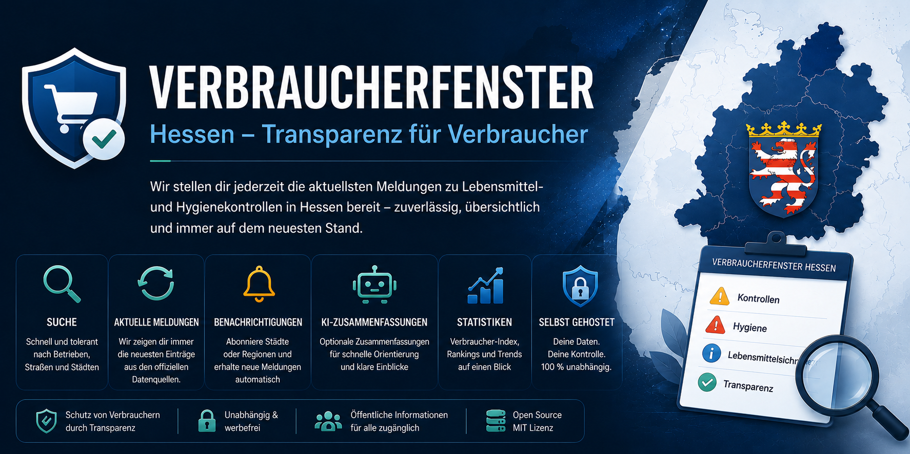

  

# Verbraucherfenster Hessen – Telegram Bot 🔍

Ein inoffizieller, intelligenter Telegram-Bot zur komfortablen Suche, automatischen Benachrichtigung und Analyse von Hygiene- und Lebensmittelmängeln in Hessen gemäß **§ 40 Abs. 1a LFGB**.

🔗 **Offizielle Projekt-Webseite:** [telegramtrainer.github.io/Verbraucherfenster](https://telegramtrainer.github.io/Verbraucherfenster/)  
✈️ **Direkt zum Bot:** [@VerbraucherfensterBot](https://telegram.me/VerbraucherfensterBot)

---

## 🎯 Das Problem & Der Mehrwert

Die offizielle Plattform für Verbrauchermängel ist im Alltag oft schwer zu durchsuchen und bietet keine automatischen Benachrichtigungen. Dieser Bot schließt die Lücke und bringt die Daten direkt und smart auf dein Smartphone.

### Hauptfeatures:
* **🔍 Tippfehlertolerante Suche:** Schnelles Durchsuchen von Betriebsname, Straße und Ort dank intelligenter Textnormalisierung – ideal für unterwegs.
* **📊 Verbraucher-Index:** Jeder Betrieb erhält einen transparenten Score (0–100) basierend auf Anzahl, Aktualität und Schweregrad der Vorfälle.
* **🔀 Intelligente Zusammenführung:** Mehrfacheinträge desselben Betriebs werden übersichtlich gebündelt, statt die Liste zu überfluten.
* **🤖 KI-gestützte Analyse (Optional):** Lange, behördliche Berichte werden automatisch in prägnante Stichpunkte zusammengefasst.

---

## 📱 Die Vorteile via Telegram

Im Vergleich zu einer klassischen Web-App bietet die Integration in Telegram entscheidende Vorteile:
* **Push-Benachrichtigungen (`/watch`):** Abonniere ganze Städte oder Regionen (z. B. *Frankfurt*, *Kassel*) und werde sofort automatisch informiert, wenn neue Mängel gemeldet werden.
* **Keine App-Installation:** Läuft nativ in Telegram – plattformübergreifend auf iOS, Android, PC und Web.
* **Intuitiv & Schnell:** Steuerung über einfache Befehle und interaktive Inline-Buttons.

---

## 🛠️ Technische Details (Übersicht)

Das System ist darauf ausgelegt, Daten effizient zu verarbeiten und benutzerfreundlich aufzubereiten:
* **Datenquelle:** Offizielle Veröffentlichungen des Verbraucherfensters Hessen nach § 40 Abs. 1a LFGB.
* **Architektur:** Event-gesteuerte Abfrage, Normalisierungs-Pipeline für Betriebsadressen und automatisches Push-Notification-System.

---

## ⚖️ Rechtlicher Hinweis

Dieses Projekt ist ein **inoffizielles Angebot** und keine amtliche Quelle. Es steht in keiner Verbindung mit den hessischen Behörden oder den offiziellen Betreibern des Verbraucherfensters Hessen. Maßgeblich und rechtsverbindlich sind ausschließlich die aktuellen Veröffentlichungen der zuständigen Behörden auf der Originalplattform.
